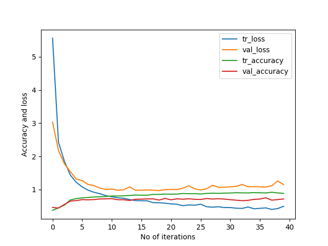

# DrivingDirection-75.2
Epoch 40: val_accuracy did not improve from 0.75242   
158/158 [==============================] - 4s 24ms/step - loss: 0.4967 - accuracy: 0.8856 - val_loss: 1.1506 - val_accuracy: 0.7178   
[[279  44  42]    
 [ 51 111   3]    
 [ 50  14 129]]    
158/158 [==============================] - 1s 6ms/step - loss: 0.4165 - accuracy: 0.9276   
23/23 [==============================] - 0s 7ms/step - loss: 1.0757 - accuracy: 0.7524     
Train: 0.928, Test: 0.752   
[[286  41  38]               
 [ 46 115   4]               
 [ 38  12 143]]             
 
 

